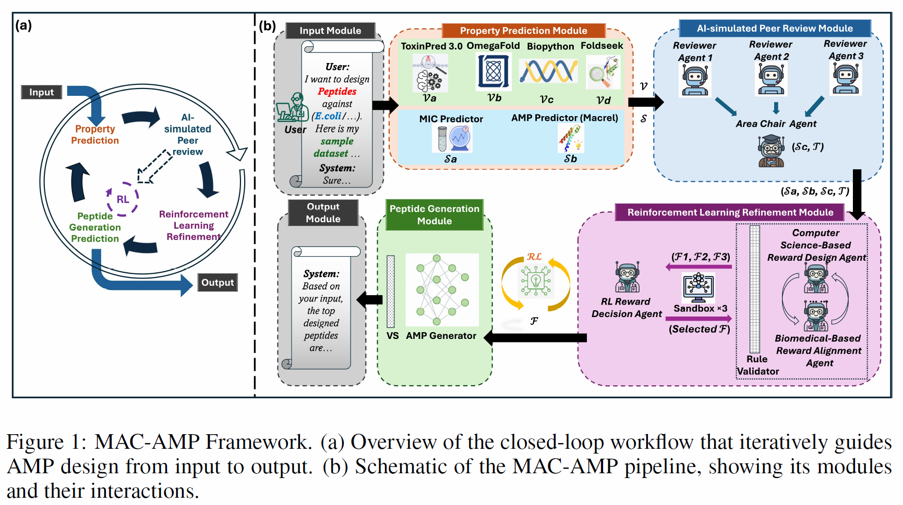
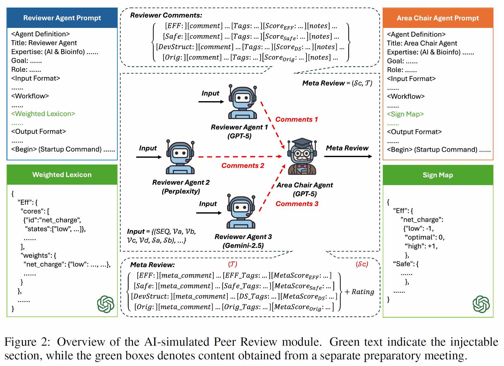
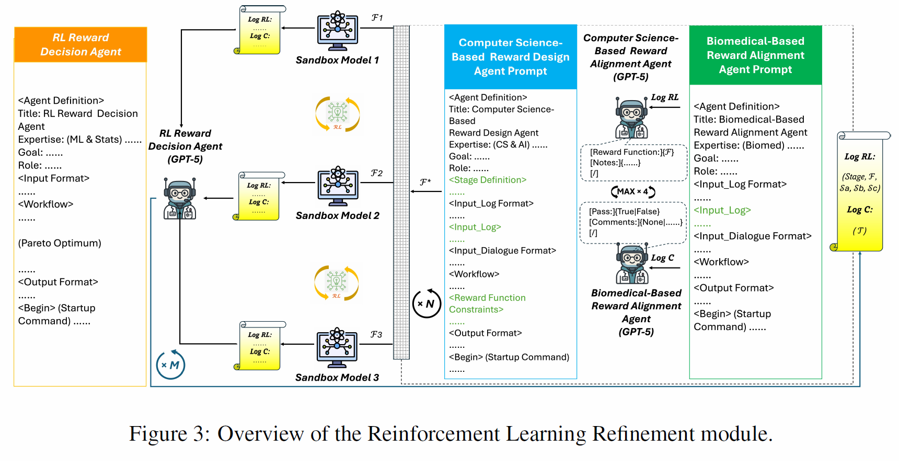

### MAC-AMP: A CLOSED-LOOP MULTI-AGENT COLLABORATION SYSTEM FOR MULTI-OBJECTIVE ANTIMICROBIAL PEPTIDE DESIGN

#### Details about MAC-AMP's architecture are illustrated below and further described in our [paper](https://openreview.net/forum?id=iW1zfncsbc).


<p align="center">
  
</p>

#### Figure 1: MAC-AMP Framework.

<p align="center">
  
</p>

#### Figure 2: Overview of the AI-simulated Peer Review module.

<p align="center">
  
</p>

#### Figure 3: Overview of the Reinforcement Learning Renement module.

---

## 1. Overview

This repository provides the codebase for our multi-agent reinforcement learning framework.  
The system performs multi-stage PPO optimization with:

- LLM-based reward code generation  
- Sandbox evaluation loops  
- Pairwise and Pareto-style reward selection  
- Third-party biological predictors (Foldseek, Macrel, ToxinPred3, OmegaFold)  

---

## 2. Environment

We provide a machine-readable conda environment in the repository.

---

## 3. Third-Party Predictors

The training workflow calls several external predictors used in the MAC-AMP pipeline:

| Tool | Purpose | Installation |
|------|----------|---------------|
| **Foldseek** | Structure similarity search | conda (`foldseek=10.941cd33`) |
| **Macrel** | AMP classification / activity features | conda (`macrel=1.5.0`) |
| **OmegaFold** | Protein structure prediction | GitHub install |
| **ToxinPred3** | Toxicity prediction | pip (`toxinpred3==1.4`) |

### **Install OmegaFold**
```bash
git clone https://github.com/HeliXonProtein/OmegaFold
cd OmegaFold
python setup.py install
```

These predictors are **not redistributed** inside this repository. Users must install them respecting their original licenses.

---

## 4. License

This project is licensed under the **MIT License**.

Third-party tools (Foldseek, Macrel, OmegaFold, ToxinPred3) retain their **original licenses**.

---
